  

I'm **Xianjie Shi** ([@Neighhhbor](https://github.com/Neighhhbor)), a CS student at **Peking University**.
I work on AI developer tools, agent infrastructure, and evaluation for code generation.

  <a href="https://github.com/polaris-pku/newide-scaffold">Agent systems</a> &nbsp; / &nbsp;
  <a href="https://github.com/jiangxxxue/KOCO-bench">Code intelligence</a> &nbsp; / &nbsp;
  <a href="https://github.com/Neighhhbor/Schedule">Tools for real life</a>

### Selected work

<table>
<tr>
<td width="50%" valign="top">
<h3><a href="https://github.com/polaris-pku/newide-scaffold">01 / Polaris</a></h3>

Backend infrastructure for coding agents: task orchestration, persistent memory, and multi-agent Council workflows.

CONTRIBUTOR · TypeScript · Agent runtime 
<a href="https://github.com/polaris-pku/newide-scaffold/pulls?q=is%3Apr+author%3ANeighhhbor+is%3Amerged">My merged contributions ↗</a>

</td>
<td width="50%" valign="top">
<h3><a href="https://github.com/jiangxxxue/KOCO-bench">02 / KOCO-bench</a></h3>

Evaluating how language models acquire and apply domain knowledge in software development. Contributions to RAG and evaluation tooling.

CONTRIBUTOR · Python · Code generation 
<a href="https://github.com/jiangxxxue/KOCO-bench/commits?author=Neighhhbor">My contributions ↗</a>

</td>
</tr>
</table>

### Around the workbench

`Python` · `TypeScript` · `Agent orchestration` · `Program analysis` · `Retrieval` · `Evaluation`

I like turning research ideas into inspectable, runnable tools — with clear interfaces and evidence of what actually works.

### A little after-hours hacking

<picture>
  <source media="(prefers-color-scheme: dark)" srcset="https://raw.githubusercontent.com/Neighhhbor/Neighhhbor/output/github-snake-dark.svg" />
  <source media="(prefers-color-scheme: light)" srcset="https://raw.githubusercontent.com/Neighhhbor/Neighhhbor/output/github-snake.svg" />
  
</picture>

Generated from my contribution graph with <a href="https://github.com/Platane/snk">snk</a> · refreshed daily

